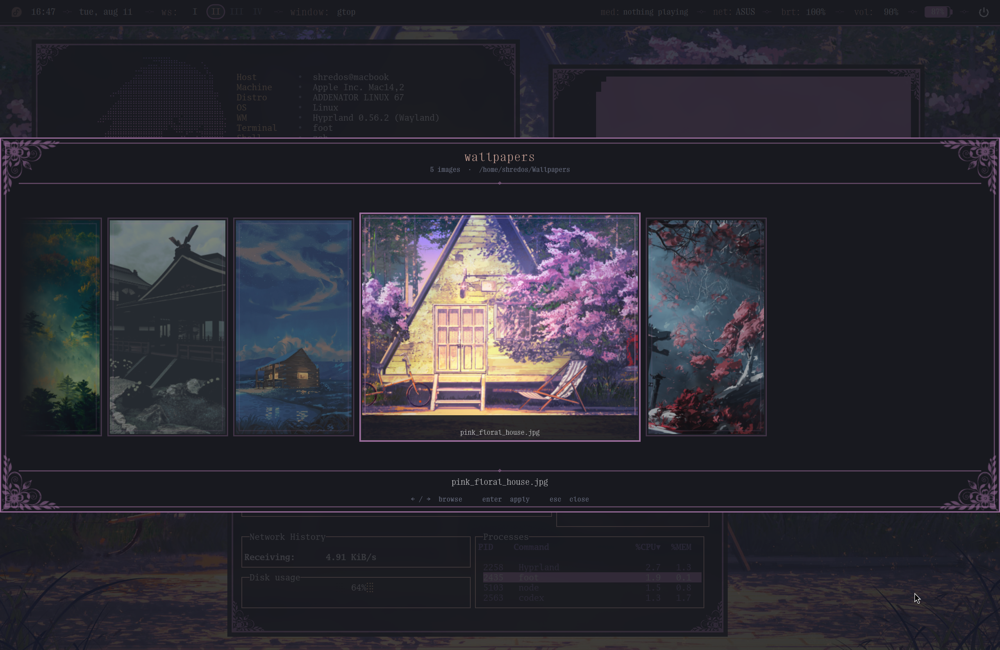

# m2 dotfiles, flowers and way too much qml

this is my fedora hyprland setup for an apple m2 machine, it started as a bar and then i apparently decided every part of the desktop needed matching engraved borders



the screenshot is the real setup at 2560x1664 and 1.33 scale, fastfetch and lavat at the top, gtop under them, quickshell bar above everything and the wallpaper picker open

## install

read it first if u care about what gets replaced

```sh
curl -fsSL https://raw.githubusercontent.com/shredos67/dotfiles/main/install.sh | sh -s -- --dry-run
```

then do the actual thing

```sh
curl -fsSL https://raw.githubusercontent.com/shredos67/dotfiles/main/install.sh | sh -s -- --yes
```

the installer downloads the repo into a temporary dir, installs what it can for the current distro, backs up every managed path, copies the configs, builds the hyprland plugins, seeds pywal and reloads the current session when one exists

backups land in

```text
~/.local/state/dotfiles-backups/<date and time>
```

options because blindly piping my whole desktop into sh is kinda rude

```text
--dry-run          print changes and touch nothing
--yes              skip the confirmation
--no-packages      only install the dotfiles
--no-plugins       skip borders plus plus and imgborders
--with-autologin   add tty1 autologin, this is off by default
--wallpaper path   use one image for the first generated theme
```

local install works too

```sh
git clone https://github.com/shredos67/dotfiles.git
cd dotfiles
./install.sh --dry-run
./install.sh
```

this is mainly made for aarch64 because the bundled caelestia qml plugin is the arm build i use, on another cpu the installer expects a system caelestia qml module and removes the bundled native files, the configs themselves arent arm specific

fedora is the actually tested distro, arch and debian package handling is there as a decent head start but package names and third party repos can still be annoying

## stuff that is actually in here

### quickshell

the shell is qml and is basically the main character here

- one top bar with four roman numeral workspaces, current window, network, media, brightness and volume, battery and time live there too whenever the dock is off
- rendered buttons and battery shapes, not a pile of font glyphs pretending to be ui
- launcher on `super space`, when the dock is enabled the dock grows into the launcher itself, turn the dock off and the normal floating launcher comes back
- power menu on `super m`, with working lock logout suspend reboot and shutdown actions
- notification drawer from the fedora corner button, notifications slide away left when dismissed and the drawer has screenshots recordings shortcuts system usage clipped floral corners and enough engraved detail to not feel like a dead rectangle
- bottom taskbar with pinned and running apps on the left, tray and the rendered battery on the right, window indicators hover magnification and proper workspace reservation, auto hide releases the space and keeps a stable bottom edge trigger
- enabling the dock moves date and time plus the battery into it, brightness and volume stay in the top bar where their useful hover controls already are
- every app in the launcher has a rendered pin button, pinning or unpinning updates the dock without closing the launcher
- settings app on `super comma`, appearance dock and motion changes are saved live, it also has real wi fi bluetooth pipewire brightness power and session controls instead of being a fake settings shaped decoration
- media popup with art seekable progress rendered controls and a real cava equalizer that reacts to whatever is playing
- matching smaller popups for network brightness and volume
- click the clock for a compact real calendar with month controls, volume and brightness changes get a tiny bar osd that stays outside the macbook notch
- network brightness volume and battery readouts are actual shortcuts now, clicking one opens the matching settings page while hover keeps the small control popup
- when the dock is off the system tray falls back into the top bar, active recording muted mic and dnd replace the window title until u deal with them
- wallpaper picker on `super w`, full width masked cards smooth cubic movement current wallpaper state metadata floral framing and no cards escaping through the top or bottom anymore
- one shared engraved popup chrome so the outer and faint inner borders actually continue from the bar
- floral png corner masks on the launcher power menu notification drawer and wallpaper picker
- shared shadows engraved inner lines accent glow and cubic motion so the floating pieces look like one setup instead of six unrelated panels
- most useful dimensions live in `~/.config/quickshell/ShellConfig.qml` so u dont have to hunt through every component again
- live colors come from `~/.config/quickshell/Theme.qml`

the main ipc calls are

```sh
qs ipc call launcher toggle
qs ipc call powerMenu toggle
qs ipc call notificationPanel toggle
qs ipc call wallpaperCarousel toggle
qs ipc call settings toggle
qs ipc call settings openPage 4
qs ipc call calendar toggle
```

logs when qml decides one comma ruined its entire life

```sh
qs log
```

the locally bundled caelestia code is used for app discovery session actions notifications mpris and system values, my actual shell layout and styling are the qml files around it

### wallpaper and the pywal mess

wallpapers live in `~/Wallpapers`, picking one calls `~/wallpaperCarousel/apply-wallpaper.sh`

the color pipeline does the expensive work first and only starts the awww transition after the apps are recolored, this avoids fighting image decode blur gtk reloads and wallpaper animation all at once

one switch updates

- quickshell theme colors
- foot and already open foot terminals
- hyprland borders and both border plugins
- hyprlock
- fastfetch ascii and terminal colors
- neovim syntax colors, open sessions watch the generated theme
- gtk three and four
- qt five and six through qtct
- nautilus colors and generated folder icons
- firefox through pywalfox

the update worker runs with lower cpu and io priority, stores state in `~/.local/state/wallpaperCarousel` and skips work when the selected wallpaper or generated colors are unchanged

awww transition defaults are at the top of `apply-wallpaper.sh`, or set these before opening quickshell

```sh
export AWWW_TRANSITION_TYPE=grow
export AWWW_TRANSITION_DURATION=0.8
export AWWW_TRANSITION_FPS=60
export AWWW_COLOR_SETTLE_DELAY=0.0
```

### hyprland

hyprland is written through lua instead of one enormous conf, `hyprland.lua` is only the entrypoint now and loads small modules for environment appearance animations layouts input bindings and rules

the live environment has rounded layered window frames, pywal gradient borders, cubic window and workspace motion and persistent workspaces one through four, compositor blur glow dimming and window shadows stay off because the floral image borders already do the visual work without cutting the frame rate in half

the extra window styling uses

- `borders-plus-plus` for the faint second border
- `imgborders` for the floral image edge
- generated pywal colors for both

the inner border radius is derived from the outer radius so the two curves dont look like unrelated circles

useful binds

| bind | thing |
| --- | --- |
| `super space` | launcher |
| `super m` | power menu |
| `super w` | wallpapers |
| `super n` | notifications |
| `super comma` | shell settings |
| `super l` | hyprlock |
| `super t` | foot |
| `super e` | nautilus |
| `super q` | close window |
| `super d` | maximize |
| `super f` | fullscreen |
| `super v` | float |
| `super arrows` | focus direction |
| `super 1` to `super 0` | change workspace |
| `super shift 1` to `super shift 0` | move window |

check the live config without guessing

```sh
hyprctl configerrors
hyprpm list
```

### hyprlock and login

hyprlock uses the same colors font double borders and floral corners as the desktop, the lock card is a wide square edged rectangle while the password circles and selected details stay rounded, it has a softer fade in and a deliberately slower fade after unlock

`~/.face` is used for the profile image, with a text fallback when it is missing

tty1 autologin is optional because that is a system security choice, pass `--with-autologin` if u want boot to go directly into the hyprland session and hyprlock instead of stopping at a tty login

### foot fastfetch and nvim

foot includes the generated pywal palette instead of keeping a static ini theme, current terminals also get osc color updates so the palette changes without reopening them

fastfetch has the custom manually colored `L_ascii.txt`, the update helper rewrites its ansi colors from the active wal palette and tells open terminals about the new values

neovim loads `lua/pywal.lua`, maps wal colors into syntax groups and watches the generated file so open editors can update too

the intended ui font is `PP Right Serif Mono`, that font is licensed and is not dumped into this repo, install your own copy if u want the exact screenshot, `Go Mono Nerd Font Mono` is used for the terminal and the installer can download it

### gtk qt nautilus and firefox

gtk and qt get muted base surfaces from foot style wal colors, brighter accents stay on labels borders and selected rows, nwg look and qtct are included mostly so normal apps stop looking like they came from another computer

nautilus gets the generated gtk css plus recolored adwaita folder icons, if nautilus is already open the wallpaper worker restarts it after the theme is ready

firefox only gets the font part of `userChrome.css`, no tab positioning urlbar hacks profile data cookies history extensions or anything else, the installer finds the active profile and enables the legacy stylesheet preference

pywalfox handles the actual browser colors separately

### screenshots and recordings

screenshots use grim and slurp and save into `~/Pictures/Screenshots`, clicking a recent one in the drawer opens it with imv

recordings use obs websocket in the background and save into `~/Videos/Screenrecordings`, obs is moved to a hidden special workspace instead of throwing a window over the desktop, the shipped pipewire restore token is blank on purpose so a new machine asks u to grant the correct screen once

the included m2 profile targets 2560x1664 at 60 fps with openh264, change the obs profile if your display or encoder is different

## private things that are very intentionally missing

- the image in the power menu, its personal and it isnt in git history either
- `.face`
- wallpapers
- the licensed pp right serif mono files
- github tokens and gh config
- firefox profile data
- obs portal restore tokens logs and auth config
- screenshots and recordings other than the one deliberate showcase image

to restore the two personal ui images after install

```sh
cp /some/profile/image ~/.face
cp /some/power/image ~/.config/quickshell/session_img.png
```

the shell still loads if they are missing, it just uses its fallback or leaves the personal image area alone

## where to tweak things

- `home/.config/quickshell/ShellConfig.qml` is sizes timings hitboxes rounding and layout
- `home/.config/quickshell/Theme.qml` is the semantic color map, wal rewrites the actual values
- `home/.config/hypr/hyprland.lua` is the tiny module entrypoint
- `home/.config/hypr/modules` is environment appearance animations layouts input bindings and rules split into files that are actually editable
- `home/.config/hypr/hyprlock.conf` is the currently generated lock theme
- `home/.config/wal/templates` is what future wallpaper themes render from
- `home/wallpaperCarousel` is wallpaper order transitions and the whole cross app sync job
- `home/.local/bin/update-imgborders-theme` recolors the floral window masks
- `home/.local/bin/update-fastfetch-theme` recolors fastfetch
- `home/.local/bin/quickshell-obs-record` is the background obs controller

## after install

make the personal folders and throw in whatever u actually want

```sh
mkdir -p ~/Wallpapers ~/Pictures/Screenshots ~/Videos/Screenrecordings
qs ipc call wallpaperCarousel open
```

choose a wallpaper once so every generated target exists, then log out and back in if plugins fonts or gtk apps were installed for the first time

if something is visually wrong after a package update, check `qs log`, `hyprctl configerrors` and `hyprpm list` before editing twelve qml files at random, speaking from experience here

## credits and license

this has modified caelestia shell parts and sits on quickshell hyprland pywal16 pywalfox awww foot fastfetch neovim obs nwg look qtct and a lot of tiny wayland tools, all the cool plumbing is theirs and the excessive matching floral borders are my problem

the repo is gpl three, see `LICENSE`
